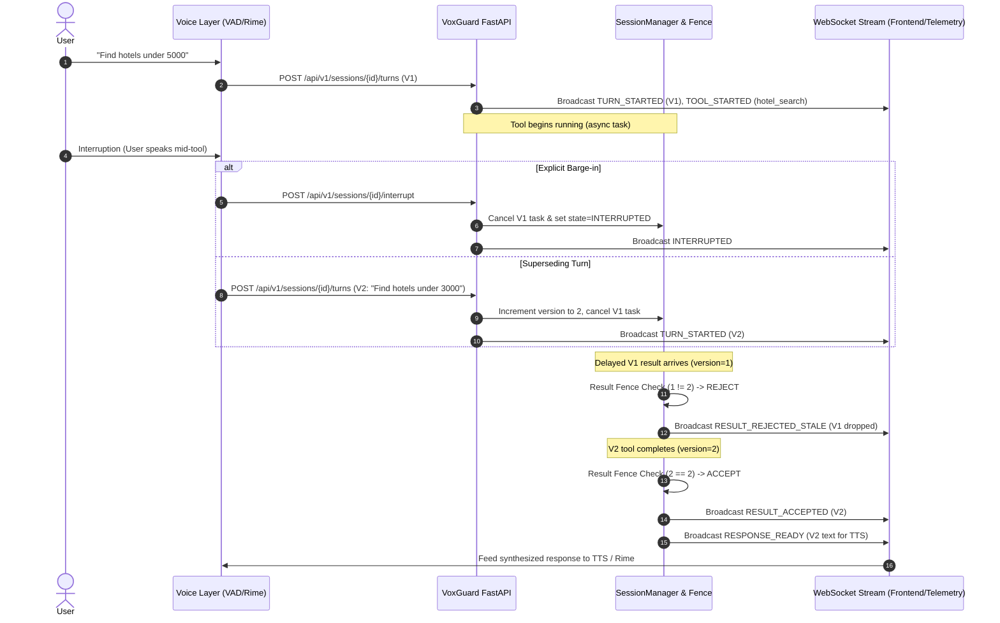

# VoxGuard Integration Contract: Voice, Telemetry & Frontend

This document specifies the integration contract for the **Voice/Rime Audio Engineer** and **Frontend/Client Application** teams interfacing with the VoxGuard runtime.

---

## Architecture Overview



---

## 1. Voice Layer Contract (Barge-in / Mid-Tool Interruption)

When the user speaks while an agent response is playing or while an asynchronous tool is running, the Voice Layer (VAD) triggers an immediate interruption.

### Explicit Interruption Endpoint
```http
POST /api/v1/sessions/{session_id}/interrupt
```

#### Behavior
- Immediately cancels any active background `asyncio.Task` executing for the session.
- Sets the session state to `INTERRUPTED`.
- Emits the `INTERRUPTED` event across the WebSocket stream.
- Guarantees that any in-flight tool results still in buffers will be rejected by the Result Fence.

#### Request Example
```bash
curl -X POST http://127.0.0.1:8000/api/v1/sessions/sess_abc123/interrupt
```

#### Response Payload (`200 OK`)
```json
{
  "session_id": "sess_abc123",
  "current_version": 1,
  "state": "INTERRUPTED",
  "last_transcript": "Find hotels in Seattle",
  "committed_version": null,
  "committed_data": {},
  "last_response": null,
  "created_at": 1788457461.52,
  "updated_at": 1788457465.18
}
```

---

## 2. Conversational Turn Submission

Turns can be started or superseded at any time. Submitting a new turn automatically fences out any ongoing work from prior turns.

### Start Turn Endpoint
```http
POST /api/v1/sessions/{session_id}/turns
Content-Type: application/json
```

#### Request Payload
```json
{
  "transcript": "Find hotels in Downtown with price under 3000",
  "state": "THINKING"
}
```

#### Behavior
1. **Monotonic Version Increment**: Automatically advances `current_version` ($V_n \to V_{n+1}$).
2. **Prior Task Cancellation**: Cancels the prior active background task if one was running.
3. **Intent Parsing & Tool Dispatch**: Automatically detects intents (e.g. `hotel_search`, `book_ride`, `get_weather`, `send_email`, `transfer_funds`, `control_device`), transitions to `TOOL_RUNNING`, and launches execution asynchronously.
4. **Immediate Ack**: Returns the updated session metadata immediately while execution proceeds in the background.

#### Response Payload (`200 OK`)
```json
{
  "session_id": "sess_abc123",
  "current_version": 2,
  "state": "TOOL_RUNNING",
  "last_transcript": "Find hotels in Downtown with price under 3000",
  "committed_version": 1,
  "committed_data": {},
  "last_response": null,
  "created_at": 1788457461.52,
  "updated_at": 1788457470.05
}
```

---

## 3. WebSocket Event Schema for Frontend & Telemetry

Connect once per session to receive all state changes, telemetry, and audio cues.

### WebSocket Connection
```http
ws://127.0.0.1:8000/api/v1/sessions/{session_id}/events
```

### Event Envelope Schema
Every WebSocket message conforms to this envelope:
```typescript
interface VoxGuardEvent {
  event_id: string;        // Unique event identifier (e.g., "evt_3a1b4c9e8f")
  event_type: string;      // One of the event types documented below
  session_id: string;      // Target session ID
  version: number;         // Session turn version at time of emission
  timestamp: number;       // Unix epoch timestamp in seconds
  payload: Record<string, any>;
}
```

---

### Key Telemetry Events

#### A. `RESULT_REJECTED_STALE`
Emitted when a delayed or interrupted tool finishes execution, but its version has been superseded by a newer turn or interruption.

```json
{
  "event_id": "evt_9b8a7c6d5e",
  "event_type": "RESULT_REJECTED_STALE",
  "session_id": "sess_abc123",
  "version": 1,
  "timestamp": 1788457472.10,
  "payload": {
    "reason": "Stale result version",
    "result_version": 1,
    "session_current_version": 2,
    "tool_name": "hotel_search"
  }
}
```
* **Frontend Action**: Drop stale cards, clear pending spinners for version 1, and show a subtle "Previous query cancelled" banner.
* **Voice Action**: Do NOT synthesize or play audio for this result.

---

#### B. `RESULT_ACCEPTED`
Emitted when a tool finishes successfully and its version matches the active session turn.

```json
{
  "event_id": "evt_4f5e6d7c8b",
  "event_type": "RESULT_ACCEPTED",
  "session_id": "sess_abc123",
  "version": 2,
  "timestamp": 1788457473.50,
  "payload": {
    "tool_name": "hotel_search",
    "success": true,
    "version": 2
  }
}
```
* **Frontend Action**: Commit and display the verified tool results (e.g. hotel listing cards, ride confirmation).

---

#### C. `RESPONSE_READY`
Emitted when natural language synthesis is complete and ready to be converted to speech or displayed.

```json
{
  "event_id": "evt_1a2b3c4d5e",
  "event_type": "RESPONSE_READY",
  "session_id": "sess_abc123",
  "version": 2,
  "timestamp": 1788457473.55,
  "payload": {
    "response": "I found 2 hotels in Downtown under $3000.",
    "tool_name": "hotel_search"
  }
}
```
* **Voice / Rime Action**: Immediately feed `payload.response` into the TTS pipeline for playback.
* **Frontend Action**: Display the agent's assistant chat bubble.

---

### Supporting Events Reference

| Event Type | Trigger | Payload Summary |
| :--- | :--- | :--- |
| `CONNECTED` | WebSocket connection opened | `{ "session_id", "current_version", "state" }` |
| `TURN_STARTED` | User submitted a new prompt | `{ "transcript", "version", "state" }` |
| `TOOL_STARTED` | Tool execution task spawned | `{ "tool_name", "arguments" }` |
| `TOOL_COMPLETED` | Tool finished raw execution | `{ "tool_name", "output", "error" }` |
| `INTERRUPTED` | User barged in or interrupted | `{ "session_id", "state": "INTERRUPTED" }` |
| `STATE_CHANGED` | Session state transitioned | `{ "state": "THINKING" \| "TOOL_RUNNING" \| ... }` |

---

## 4. Summary Table of Endpoints

| Method | Path | Description | Typical Caller |
| :--- | :--- | :--- | :--- |
| `POST` | `/api/v1/sessions` | Initialize new session | Frontend app launch |
| `GET` | `/api/v1/sessions/{id}` | Inspect current session state | Frontend polling / recovery |
| `POST` | `/api/v1/sessions/{id}/turns` | Submit user transcript / turn | Voice Layer / ASR / Chat input |
| `POST` | `/api/v1/sessions/{id}/interrupt` | Trigger immediate mid-tool cancellation | Voice Layer (VAD barge-in) |
| `POST` | `/api/v1/sessions/{id}/results` | Submit raw tool execution result | Integration tests / external workers |
| `WS` | `/api/v1/sessions/{id}/events` | Real-time event telemetry stream | Frontend UI / Telemetry collectors |
